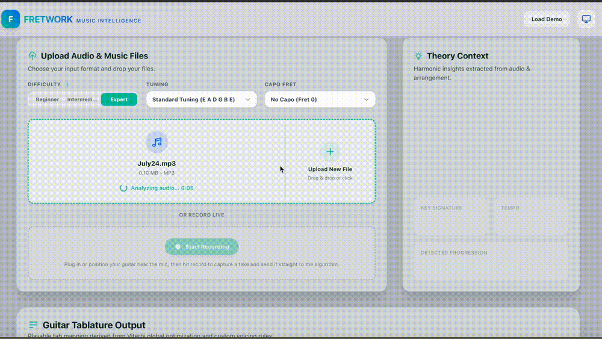
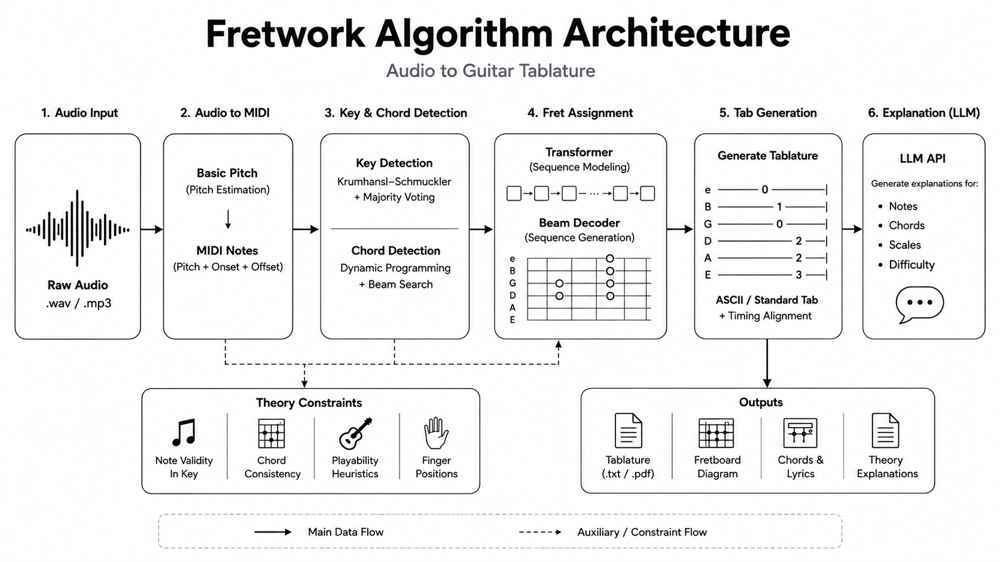

# Fretwork

<p align="center">
  
</p>

**Fretwork** is an AI-powered guitar transcription platform that converts raw guitar recordings into playable guitar tablature. Unlike traditional transcription tools, Fretwork optimizes *how* notes are played, producing natural fingerings through transformer-guided fret assignment and beam search while allowing users to customize and edit the generated tabs.

---

## Features

- 🎸 Convert recorded guitar audio into playable tablature
- 🎼 Detect notes, keys, chords, and musical context
- 🧠 Transformer-guided fret assignment with beam search optimization
- 🎯 Multiple playable fingerings and difficulty levels
- ✏️ Interactive note editing and alternate arrangements
- ⚡ End-to-end transcription in seconds

---

## Performance

| Method | Pitch F1 | End-to-End Tab F1 | Avg. Time |
|---------|---------:|------------------:|-----------:|
| **Fretwork** | **79.9%** | **59.7%** | **3.8 sec** |
| ChatGPT | 60.6% | 37.6% | 1.3 min |
| SongScription | 36.4% | 30.6% | 30 sec |

Compared with identical GuitarSet recordings and evaluation protocol:

- **+22.1%** End-to-End Tab F1 vs. ChatGPT
- **+29.1%** End-to-End Tab F1 vs. SongScription
- **20× faster** than ChatGPT

---

## Architecture

<p align="center">
  
</p>

Fretwork follows a multi-stage pipeline:

1. Audio transcription
2. Pitch detection
3. Musical context extraction (key + chords)
4. Transformer-guided fret assignment
5. Beam search decoding
6. Interactive tablature generation

The fret assignment model scores every valid string/fret combination using musical context and playability heuristics before beam search finds the smoothest complete tablature sequence.

---

## Tech Stack

**Machine Learning**
- Python
- PyTorch
- Transformer models
- Beam Search

**Music Processing**
- Spotify Basic Pitch
- Librosa
- AutoChord
- AlphaTab

**Backend**
- FastAPI
- AWS ECS Fargate

**Frontend**
- Next.js
- Cloudflare Pages

---

## Repository Structure

```
backend/                 FastAPI backend
fretwork/                Next.js frontend
scripts/                 Utility scripts
config/                  Configuration
docs/                    Documentation
jupyter_notebooks/       Experiments
```

---

## Roadmap

- [ ] Support bends, slides, hammer-ons, and vibrato
- [ ] Additional guitar tunings
- [ ] Bass transcription
- [ ] MIDI export
- [ ] Larger benchmark suite

---

## Contributors

- Aaron Luong
- Kobby Hanson
- Ani Sreekumar
- Zev Rosen 

---

## Acknowledgements

Special thanks to the teams behind:

- GuitarSet
- DadaGP
- Spotify Basic Pitch
- AlphaTab
