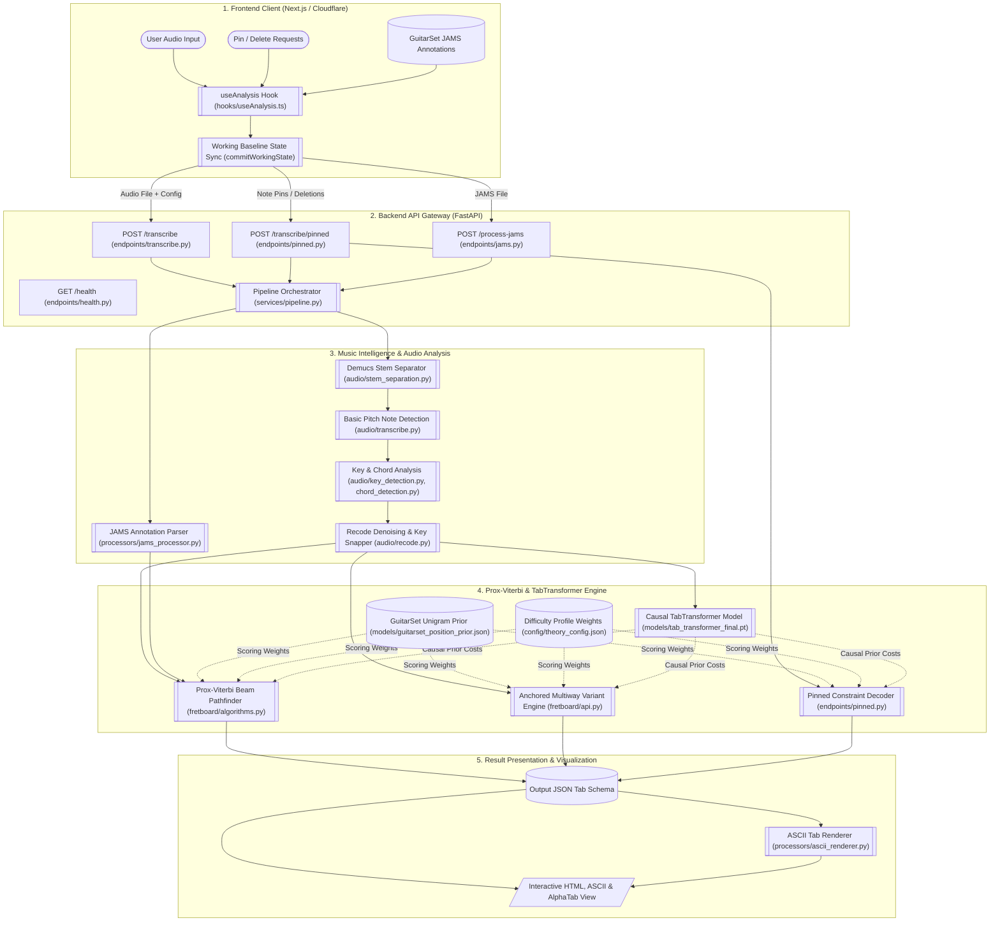

# System Architecture: Fretwork

## Core Team & Roles

| Name | Role | Contact |
| :--- | :--- | :--- |
| **Zev Rosen** | Project Manager | zar27@ischool.berkeley.edu |
| **Ani Sreekumar** | Product Manager | anisreekumar@berkeley.edu |
| **Kobby Hanson** | Lead Developer / Infrastructure | kobbyhanson@berkeley.edu |
| **Aaron Luong** | Model Evaluation | aaluong@berkeley.edu |

---

## Architecture Overview

Fretwork translates raw audio into playable guitar tabs. The system runs as a **Next.js** frontend on Cloudflare Pages and connects to a containerized **FastAPI backend** hosted on AWS ECS Fargate.

1. **Audio & Harmonic Analysis**: Uses **Basic Pitch** for polyphonic note detection, **Librosa** for key estimation, and sliding-window chord analysis directly on the uploaded audio.
2. **Filtering & Context**: Maps notes to the detected key and drops ghost notes using threshold rules in `backend/audio/recode.py`.
3. **Prox-Viterbi & TabTransformer Decoder**: Evaluates positions using CAGED hand shapes, GuitarSet position statistics, and a 1M-parameter **Causal TabTransformer** (`tab_transformer_final.pt`) via beam search ($W=2.0, k=8$).
4. **Alternative Fingerings**: Generates candidate fingerings anchored to different neck positions (frets 3, 8, and 12).
5. **Pinning Constraints**: Accepts manual note pins or deletions via `POST /api/pinned` and `POST /api/transcribe/pinned`, passing constraints down to `POST /transcribe/pinned` on the backend.
6. **Difficulty Profiles**: Adjusts movement penalties, maximum hand spans, and barre chord costs for `beginner`, `intermediate`, and `expert` modes.
7. **Demo Fallback Pipeline**: Loads the sample audio (`demo.mp3`) via `/api/transcribe`. If the request times out after 20 seconds, it falls back to pre-calculated annotations (`demo.jams`), then to a client-side TypeScript solver if needed.
8. **API Gateway**: Standardized FastAPI routes (`endpoints/transcribe.py`, `endpoints/pinned.py`, `endpoints/jams.py`, `endpoints/health.py`) managed by `services/pipeline.py`.

---

## System Dataflow

