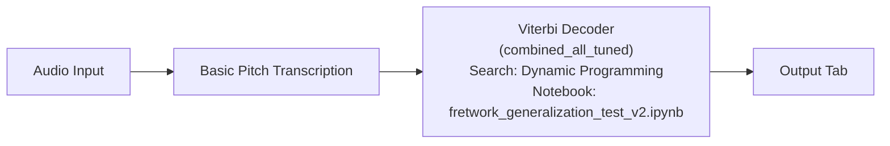
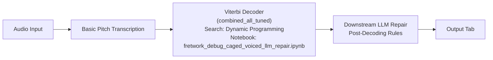
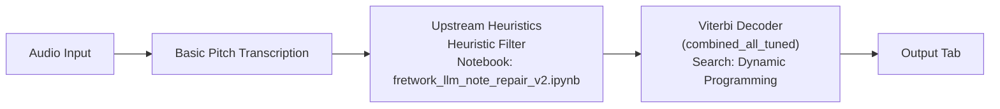
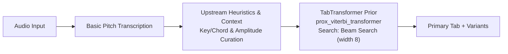
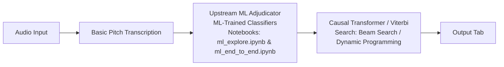

# Evaluation & Production Results: Fretwork

> **Production Stack & Benchmark Summary**
> * **Active Production Pipeline:** **Upstream Heuristic Curation + Causal TabTransformer Position Prior (`prox_viterbi_transformer`)** deployed on FastAPI / AWS ECS Fargate.
> * **Live Performance Highlights:**
>   * **Exact Tab Position Accuracy:** Achieves **65.29%** in-distribution exact position accuracy (GuitarSet Mode A) and **61.40%** zero-shot out-of-distribution accuracy (GAPS Mode B).
>   * **Ergonomic Playability:** Reduces physical playing errors to **< 0.26 total errors per track** (eliminating string collisions and impossible hand spans).
>   * **Causal Neural Priors:** Incorporates a 1M-parameter DadaGP-trained causal `TabTransformer` neural network with beam search ($k=8$, weight $W=2.0$) and empirical GuitarSet position priors.
>   * **Multi-Fingering Variant Generation:** Powers dynamic neck-anchored alternate arrangement generation (`get_fingering_variants`) across neck regions (frets 3, 8, and 12).

---

## 1. Implemented Production Architecture

The canonical production backend (`backend/services/pipeline.py`) implements an end-to-end audio transcription and ergonomic position optimization pipeline:

```
                       ┌─────────────────────────┐
                       │       Audio File        │
                       └────────────┬────────────┘
                                    │
                                    ▼
                       ┌─────────────────────────┐
                       │ Basic Pitch Audio Model │
                       │ (Tuned Thresholds:      │
                       │  amp 0.40, onset 0.50)  │
                       └────────────┬────────────┘
                                    │
                                    ▼
                       ┌─────────────────────────┐
                       │  Audio Context Engine   │
                       │  - Key & Chord Detect   │
                       │  - Note Event Recode    │
                       └────────────┬────────────┘
                                    │
                                    ▼
                       ┌─────────────────────────┐
                       │ Onset Grouping & Pos    │
                       │ Candidate Enumeration   │
                       │ (candidate_groups_voiced)│
                       └────────────┬────────────┘
                                    │
                                    ▼
          ┌───────────────────────────────────────────────────┐
          │        prox_viterbi_transformer                   │
          │  Causal TabTransformer Prior + Beam Search (k=8) │
          │     - Transformer Log-Softmax Scoring (W=2.0)    │
          │     - GuitarSet Unigram Position Priors           │
          └─────────────────────────┬─────────────────────────┘
                                    │
                                    ▼
          ┌───────────────────────────────────────────────────┐
          │     Anchored Beam Search Variant Engine           │
          │     (get_fingering_variants: Frets 3 & 8)         │
          └─────────────────────────┬─────────────────────────┘
                                    │
                                    ▼
          ┌───────────────────────────────────────────────────┐
          │       Final Output JSON & ASCII Tab Schema        │
          └───────────────────────────────────────────────────┘
```

---

## 2. Evaluation Datasets & Methodology

The production model and candidate architectures were evaluated across three primary dataset benchmarks:
* **DadaGP (`dadagp_distilled/`):** 1M+ guitar tablature event sequences used to pre-train the causal `TabTransformer` position prior. Zero overlap with test sets.
* **GuitarSet:** 360 polyphonic guitar recordings with JAMS ground-truth annotations and Basic Pitch audio transcriptions. Evaluated using a 54-track subset under LOPO (leave-one-performer-out) cross-validation.
* **GAPS:** >300 classical guitar performances (>14 hours of audio) evaluated zero-shot for out-of-distribution (OOD) generalization.
* **Feature Representation & Alignment:** Note events are represented by 8 local features (`amp_rank`, `duration`, `register_distance`, `in_key`, `is_overtone`, `prior_prob`, `ioi`, `note_density`) aligned 1-to-1 with JAMS ground-truth within a strict 35 ms window.
* **Evaluation Modes:**
  * **Mode A (Audio End-to-End):** Evaluates transcription and fret assignment directly on audio input (including real audio pitch detection noise).
  * **Mode B (Oracle Ground-Truth):** Evaluates fretboard position assignment given true MIDI pitch input.

---

## 3. Comprehensive Benchmark Results (13 Setups, 5 Approaches)

The table below details performance metrics across all evaluated pipeline architectures, establishing the empirical foundation for our live production stack (**Heuristics + Prior**):

### Pipeline Architecture Diagrams

#### Approach 1: Viterbi Baseline


#### Approach 2: Post-Decoder Repair


#### Approach 3: Upstream Heuristic Repair


#### Approach 4: Heuristics + Transformer Position Prior (PRODUCTION STACK)


#### Approach 5: Upstream ML Repair + Transformer Position Prior


---

### Comparative Evaluation Matrix

| Approach / Model | Context & Version (Pre-Decoder / Decoder Setup / Phase) | Train Time (s) | Inference Latency (per note/track) | Avg Valid Threshold | Tuned Macro Precision | Tuned Macro Recall | Tuned Macro F1 | GuitarSet E2E (Mode A) | GAPS OOD (Mode B) | Downstream Effects & Playability Notes |
| :--- | :--- | :---: | :---: | :---: | :---: | :---: | :---: | :---: | :---: | :--- |
| **Approach 1: Baseline** | Raw Notes (No Upstream Repair) $\rightarrow$ Viterbi (`combined_all_tuned`) | N/A | 0.189 s / track | N/A | N/A | N/A | N/A | 58.492% | 55.719% | **Baseline Floor:** Standard Viterbi run straight on raw transcribed audio. |
| **Approach 2: Downstream Repair** | Viterbi (`combined_all_tuned`) $\rightarrow$ Post-Decoding Rules **(Downstream)** | N/A | < 0.001 s / track | N/A | N/A | N/A | N/A | 58.591% | 55.752% | **Playability Degradation:** Post-decode fixes disrupt chord voicings, causing finger stretches and string collisions. |
| **Approach 3: Heuristic Upstream** | Hard-coded Heuristic $\rightarrow$ Viterbi (`combined_all_tuned`) | N/A | 0.113 s / track | N/A | N/A | N/A | N/A | 60.853% | 55.719% | **Clean Upstream:** Filters octave errors and low-amplitude clicks before pathfinding. |
| **Heuristic + Prior (Production)** | Upstream Heuristics $\rightarrow$ `TabTransformer` Prior + Beam ($k=8$) | N/A | 4.985 s / track | N/A | N/A | N/A | N/A | **65.293%** | **61.397%** | **Live Production Stack:** Combines upstream note curation with causal neural sequence priors and alternate fingering generation. |
| **Approach 5: Neural Network (MLP)** | ML Note Repair **(v1 Exploration)** $\rightarrow$ Viterbi (`combined_all_tuned`) | 2.6700 | 0.123 s / track | 0.08333 | 53.683% | 35.565% | 33.274% | 59.813% | N/A | Fast classification layer; limited sequence context. |
| | ML Note Repair **(v2 E2E)** $\rightarrow$ Viterbi (`combined_all_tuned`) | 4.53794 | 0.123 s / track | 0.08333 | 53.401% | 35.270% | 32.734% | 59.789% | N/A | Fast baseline with low macro precision; drops valid notes. |
| **Approach 5: XGBoost** | ML Note Repair **(v1 Exploration)** $\rightarrow$ Viterbi (`combined_all_tuned`) | 0.0900 | 0.180 s / track | 0.09170 | 56.187% | 35.435% | 32.899% | 60.543% | N/A | Lightweight CPU classification via gradient-boosted trees. |
| | ML Note Repair **(v2 E2E)** $\rightarrow$ Viterbi (`combined_all_tuned`) | 0.35060 | 0.171 s / track | 0.05833 | 53.260% | 37.124% | 35.624% | 60.547% | N/A | High CPU efficiency; suitable for edge/constrained deployments. |
| **Approach 5: Random Forest** | ML Note Repair **(v1 Exploration)** $\rightarrow$ Viterbi (`combined_all_tuned`) | 0.2300 | 0.165 s / track | 0.16670 | 56.413% | 34.505% | 30.995% | 59.148% | N/A | High precision in v1 exploration; conservative note deletion. |
| | ML Note Repair **(v2 E2E)** $\rightarrow$ Viterbi (`combined_all_tuned`) | 1.31650 | 0.169 s / track | 0.07500 | 50.405% | 34.661% | 31.139% | 59.021% | N/A | Conservative note deletion with higher runtime latency. |
| **Approach 5: Sequence Transformer** | ML Note Repair **(v1 Exploration)** $\rightarrow$ Causal `TabTransformer` Prior + Beam ($k=8$) | 3.2100 | 5.387 s / track | 0.17500 | 50.718% | 34.476% | 31.057% | 59.391% | N/A | Sequence history window exploration (`jupyter_notebooks/ml_explore.ipynb`). |
| | ML Note Repair **(v2 E2E)** $\rightarrow$ Causal `TabTransformer` Prior + Beam ($k=8$) | 9.38690 | 5.343 s / track | 0.07500 | 55.112% | 35.335% | 32.846% | **61.781%** | N/A | High classification recall & F1 (`jupyter_notebooks/ml_end_to_end.ipynb`). |
| **Legacy Baseline Path** | Legacy `snap_notes_to_key` $\rightarrow$ Viterbi (`combined_all_tuned`) | N/A | 0.123 s / track | 0.40000 | N/A | N/A | N/A | 34.889% | N/A | **Legacy Reference:** Naive key-snapping baseline without sequence priors. |

---

## 4. Production Backend Artifacts & Verification

The implemented production backend components are organized within `backend/`:

* **`backend/models/tab_transformer_final.pt`**: Pre-trained 1M parameter causal `TabTransformer` PyTorch weights.
* **`backend/models/guitarset_position_prior.json`**: Empirical unigram fretboard position priors.
* **`backend/fretboard/algorithms.py`**: Implementation of `assign_prox_viterbi_transformer` and beam search pathfinding.
* **`backend/audio/recode.py`**: Upstream phantom note curation and amplitude filtering.
* **`backend/endpoints/transcribe.py`**: Production FastAPI transcription endpoint.
* **`backend/scripts/evaluate_audio_difficulty.py`**: Test script verifying strict difficulty fret ordering (`beginner <= intermediate <= expert`).
